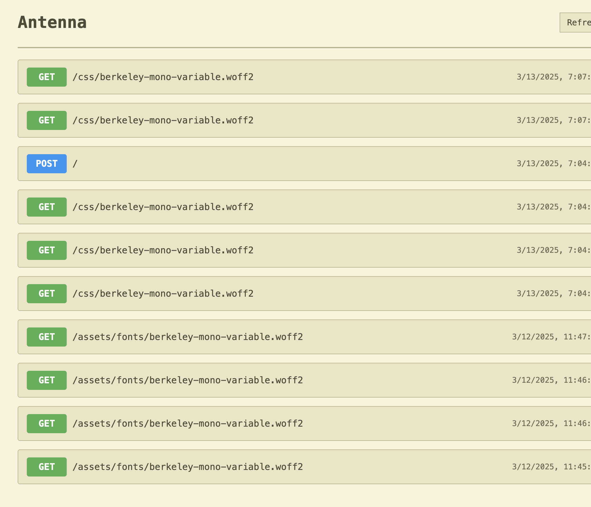

# Antenna

A simple HTTP request capture and inspection tool. Antenna captures all incoming HTTP requests and displays them in a clean interface for debugging and testing.



## Features

- Captures all incoming HTTP requests
- Displays request details including headers, query parameters, and body
- Real-time updates with refresh button
- Clear view functionality

## Getting Started

```bash
# Install dependencies
npm install

# Start the server
npm start
```

The server will run on http://localhost:29999 by default.

## Docker

```bash
# Build and run with Docker Compose
docker-compose up
```

---

under [its-ours](https://www.its-ours.org) license.
